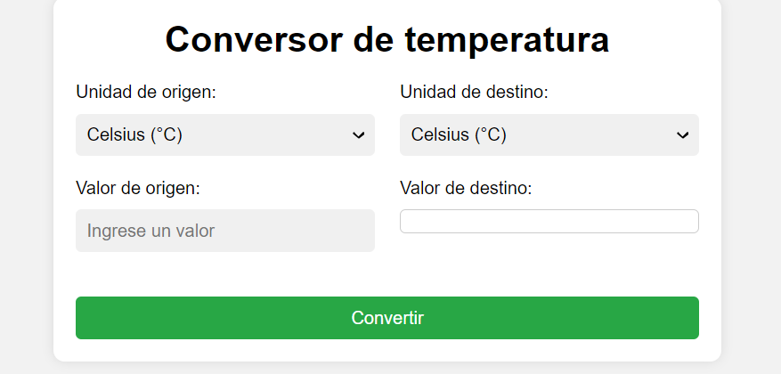

# Conversor de temperatura

Este es un conversor de temperatura en línea que permite convertir entre Celsius, Fahrenheit y Kelvin. Puede ingresar un valor en cualquiera de las tres escalas de temperatura y el conversor convertirá automáticamente el valor a las otras dos escalas.

## Uso

Para utilizar el conversor, simplemente siga estos pasos:

1. Seleccione la unidad de temperatura de origen en el primer menú desplegable.
2. Seleccione la unidad de temperatura de destino en el segundo menú desplegable.
3. Ingrese el valor de origen en el campo de entrada de valor.
4. Haga clic en el botón "Convertir".
5. El resultado de la conversión se mostrará en el campo de resultado.

## Unidades de temperatura admitidas

El conversor admite las siguientes unidades de temperatura:

- Celsius (°C)
- Fahrenheit (°F)
- Kelvin (K)

## Tecnologías utilizadas

Este conversor fue construido utilizando HTML, CSS y JavaScript.

## Demo del código

Puedes ver el resultado final del código aquí: https://demos-github-jl.000webhostapp.com/Proyectos-Simples/convertidor_de_unidades_básico.html

## Autor

Este conversor fue creado por Jesús L. Si tiene alguna pregunta o sugerencia, no dude en ponerse en contacto conmigo.

## Licencia

Este proyecto está bajo la Licencia MIT. Consulte el archivo LICENSE para obtener más detalles.

## Captura del proyecto

  
  

