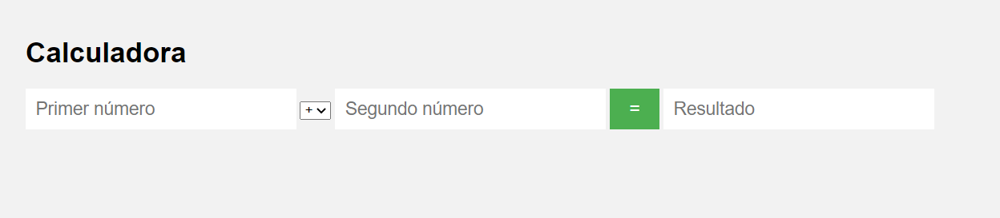

# Calculadora en PHP

Este es un proyecto de calculadora básica programada en PHP, HTML, CSS y JS. La calculadora permite al usuario ingresar dos números y seleccionar una operación de suma, resta, multiplicación o división. Al hacer clic en el botón de "igual", la calculadora realiza la operación seleccionada y muestra el resultado en un campo de texto.

## Uso

Para utilizar la calculadora, simplemente ingresa dos números en los campos de entrada y selecciona la operación que deseas realizar. Luego haz clic en el botón de "igual" para mostrar el resultado en el campo de texto correspondiente.

## Personalización

Puedes personalizar la calculadora para agregar más funcionalidades o para cambiar el diseño y estilo según tus preferencias. El código fuente se proporciona como ejemplo para que puedas modificarlo y adaptarlo a tus necesidades.

## Contribuciones

Si deseas contribuir al proyecto, siéntete libre de hacer un fork del repositorio y enviar tus cambios a través de un pull request. Todas las contribuciones son bienvenidas y apreciadas.

## Autor

Este proyecto fue creado por Jesús Londoño y está disponible bajo la licencia MIT. Si tienes alguna pregunta o sugerencia, no dudes en ponerte en contacto conmigo a través de mi perfil de GitHub.

## Captura del proyecto

