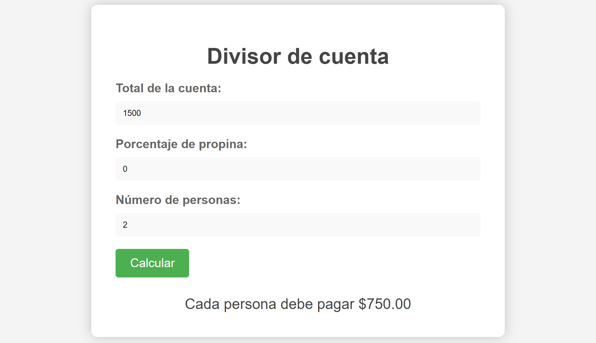

# Divisor de cuenta

Este proyecto es una herramienta en línea para calcular la división de la cuenta de un restaurante entre un número de personas y agregar una propina.

## Funcionamiento

1. Ingresa el total de la cuenta en el campo "Total de la cuenta".
2. Ingresa el porcentaje de la propina que deseas agregar en el campo "Porcentaje de propina".
3. Ingresa el número de personas que van a pagar la cuenta en el campo "Número de personas".
4. Haz clic en el botón "Calcular" para obtener el total que debe pagar cada persona.

## Tecnologías utilizadas

Este proyecto utiliza HTML, CSS y JavaScript.

## Ejecución

Para utilizar este proyecto, simplemente abre el archivo `index.html` en tu navegador web.

## Personalización

Si deseas personalizar este proyecto, puedes modificar la etiqueta `<style>` para cambiar la apariencia visual del sitio, o  la etiqueta `<script>` para cambiar la funcionalidad.

## Contribuciones

Las contribuciones son bienvenidas! Si deseas mejorar este proyecto, siéntete libre de hacer un fork y crear una solicitud de extracción con tus cambios.

## Licencia

Este proyecto está bajo la Licencia MIT.

## Captura del proyecto

  
  

